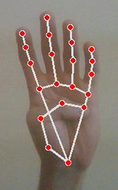
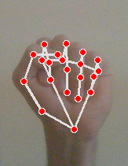

## Hand Gesture Recognition for Cursor Control
Control your mouse with hand gestures detected from a webcam using MediaPipe Hands and PyAutoGUI.

Project structure:
- `app.py`: Captures webcam frames, runs MediaPipe Hands, draws landmarks, and delegates actions.
- `controller.py`: Maps hand landmark states to cursor movement, scrolling, zooming, clicks, and dragging.
- `requirements.txt`: Pinned dependencies known to work on Windows with Python 3.11.
- `gestures/`: Reference images for each gesture.

### Prerequisites
- Windows 10/11 with a working webcam
- Python 3.11 (installed via Microsoft Store or python.org)

### Quick Start (Windows, PowerShell)
From the project root:

```powershell
Install dependencies
python -m pip install -r requirements.txt
# 3) Run
python app.py
```
To stop: Press Esc in the OpenCV window, or press Ctrl+C in the terminal.
### Fingers


| Action              | Description                                                         | Reference                                       |
| ------------------- | ------------------------------------------------------------------- | ----------------------------------------------- |
| **Cursor Moving**   | Raise all fingers together and,move your hand to move the cursor and control it.|                                              |
| **Cursor Freezing** | Thumb down, all other fingers up. Prevents mouse movement.          |  |
| **Drag and Drop**   | All fingers down (fist). Holds left mouse button until you release. |                       |
| **Left Click**      | Index fingertip inside thumb area; middle, ring, little up.         |           |
| **Right Click**     | Middle fingertip inside thumb area; index, ring, little up.         |         |
| **Double Click**    | Ring fingertip inside thumb area; index, middle, little up.         |       |
| **Scroll Up**       | Little finger up; index, middle, ring down.                         |          |
| **Scroll Down**     | Index finger up; middle, ring, little down.                         |      |
| **Zoom Out**        | Index + middle up, ring + little down, fingers close together.      |            |
| **Zoom In**         | Index + middle up, ring + little down, fingers apart.               |              |


Notes:
- Landmark indices follow MediaPipe Hands (e.g., 4 = thumb tip, 8 = index tip, 12 = middle tip, 16 = ring tip, 20 = little tip).
- The controller clamps the cursor near screen edges and smooths deltas relative to the previous hand position.

### Troubleshooting
- Camera not opening or black frame: Close other apps using the webcam. Try a different camera index in `app.py` (`cv2.VideoCapture(1)` etc.).
- Window not closing: Press Esc in the OpenCV window. If needed, press Ctrl+C in terminal. The app releases the camera and closes windows on exit.
- Sensitivity/steering: The movement uses landmark 9; adjust logic in `Controller.get_position` (`ratio`, `threshold`) to tune.

### How It Works
`app.py` flips the frame, converts to RGB, runs MediaPipe Hands, draws landmarks, and updates global hand state used by `controller.py`. The controller computes finger-up/down states, detects composite gestures, and uses PyAutoGUI to control the OS cursor and input.
